!!! danger "Goals"
    1. Practice with Armitage
    2. Gain access to the Metasploitable and Windows XP machines

**Reference**: [Engelbretson, p116]

**Quickstart**:

??? reminder "1. Start Armitage (you can leave default parameters)"
    

??? reminder "2. Let Armitage start Metasploit RPC server"
    
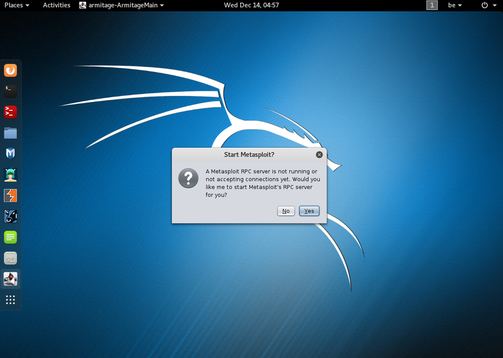

??? reminder "3. Wait for Armitage to connect (no worry about the error message)"
    
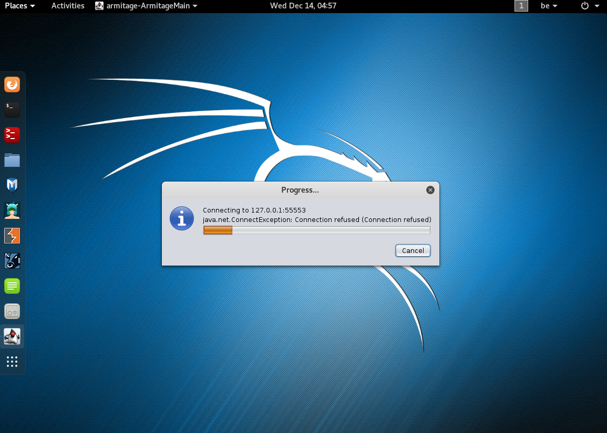

??? reminder "4. Now, Armitage is ready"
    
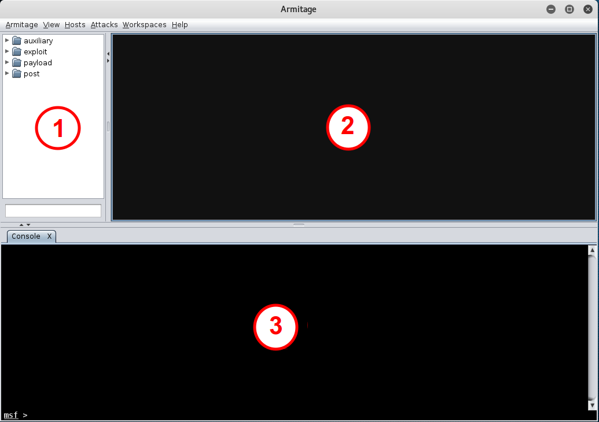

    1. Exploits/payloads/... browsing pane
    2. Visualization pane (for graphically interacting with Metasploit)
    3. Console pane (for interacting in CLI with Metasploit)

---

### Network Scanning

??? reminder "1. Select *Quick Scan (OS detect)* in the *Hosts* menu"
    
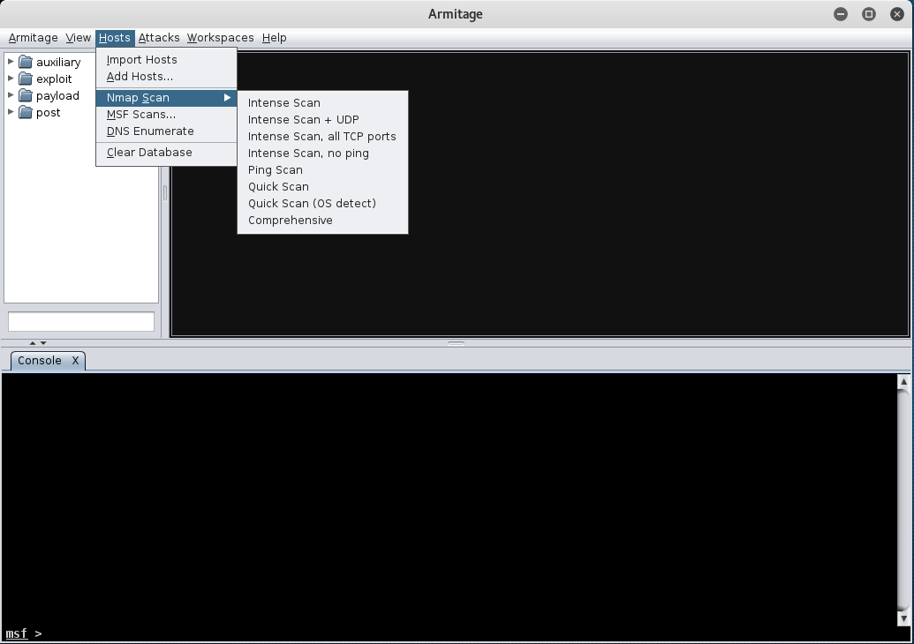

??? reminder "2. Enter the network IP range and click *OK*"
    
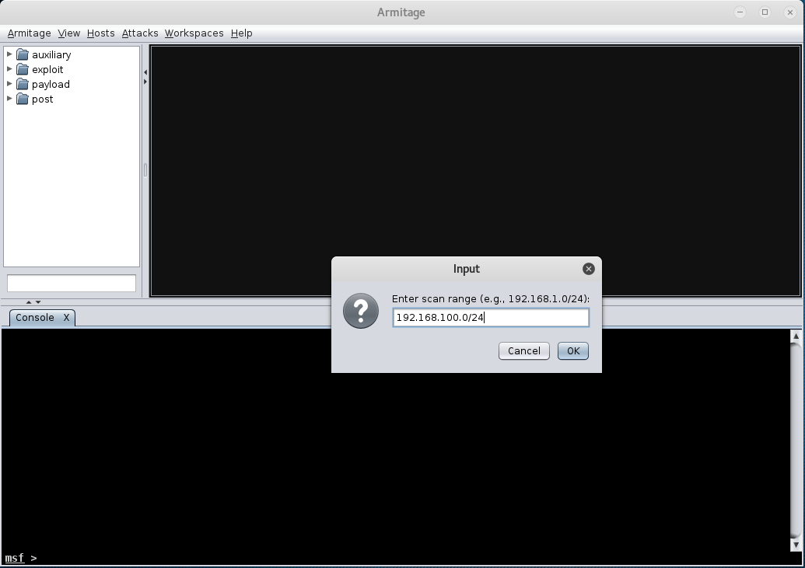

??? reminder "3. Now, the scan is complete and the running devices appear in the visualization pane"
    
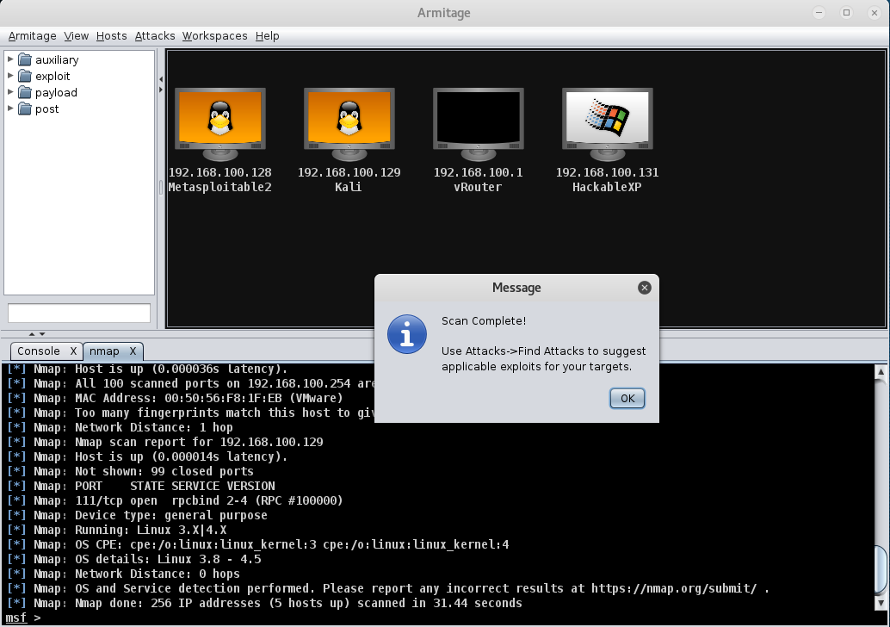

    !!! note "Adding labels and selecting the right OS"
        By right-clicking on the icon of a device, in the *Host* sub-menu, multiple parameters can be set as the OS or a label.

---

### Launching an Attack

??? reminder "1. Click on a target to select it then go to the *Attacks* menu and click on *Find Attacks*"
    
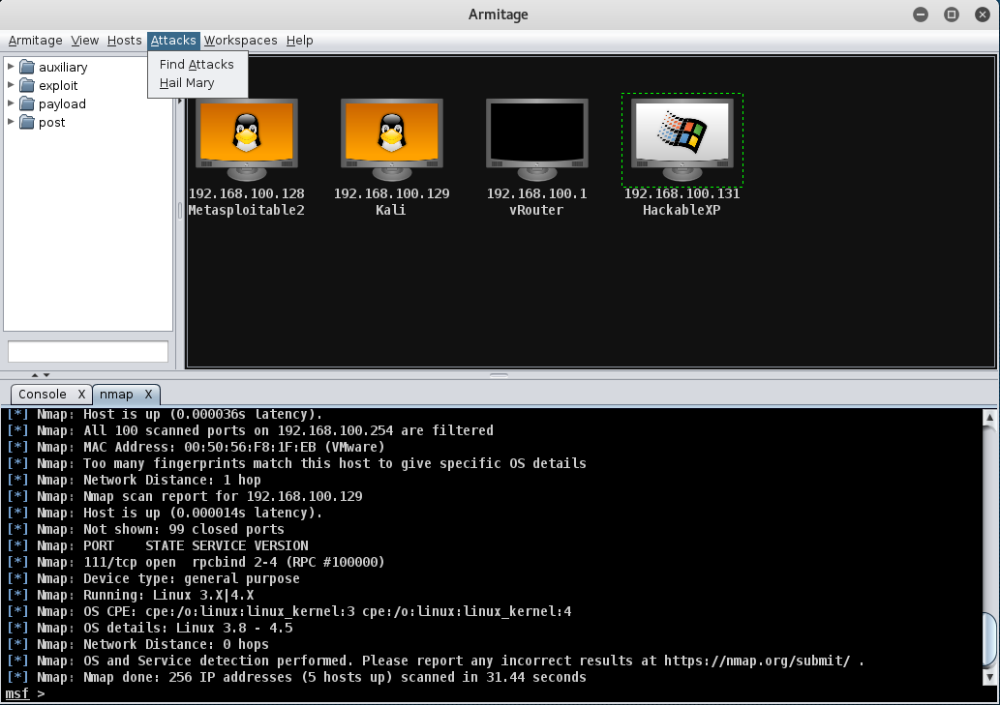

??? reminder "2. Once the analysis completes, a new sub-menu *Attack* can be found by right-clicking the target"
    
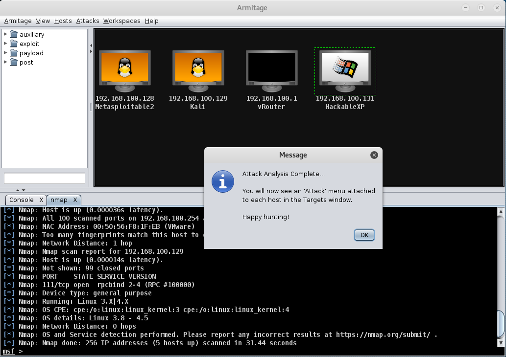

??? reminder "3. Right-clik on the target, go to sub-menu *Attack* and select an attack, e.g. *ms08_067_netapi*"
    
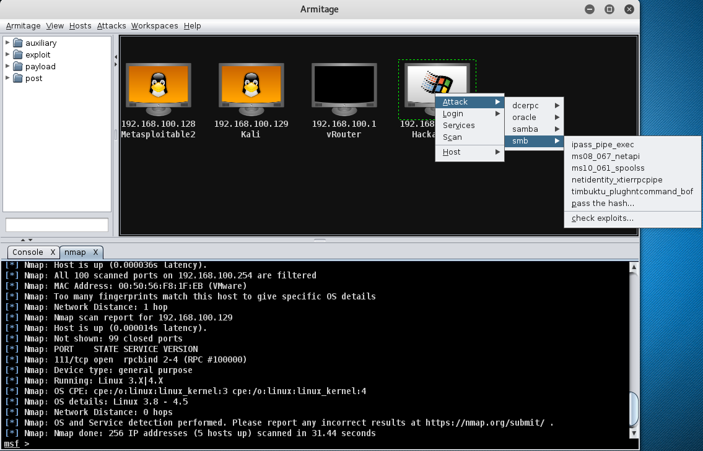

??? reminder "4. Leave default parameters and click *Launch*"
    
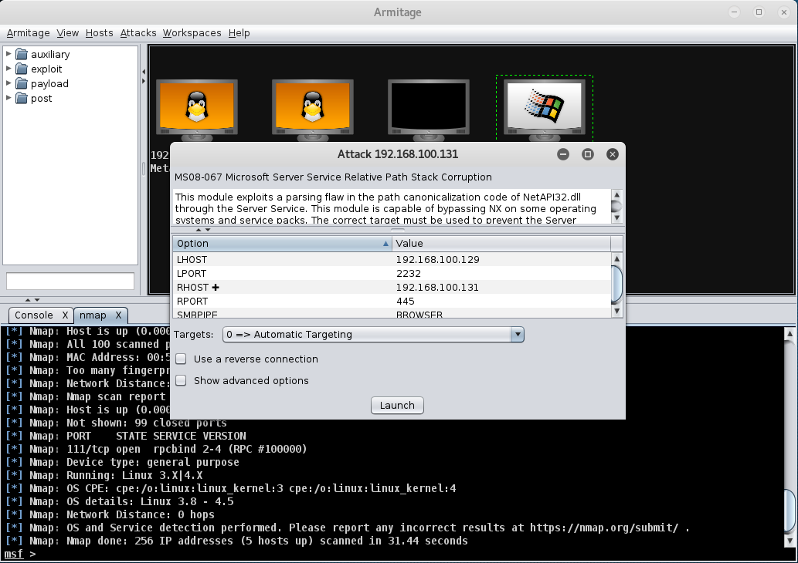

??? reminder "5. The target is owned (depicted by the lightning around it), a new sub-menu *MeterpreterX* can be found by right-clicking the target"
    
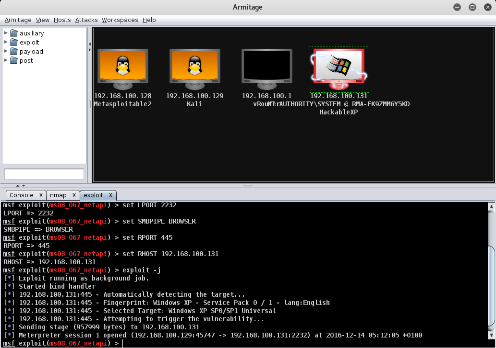

---

### Getting a shell

??? reminder "1. Right-clik on the target, go to sub-menu *MeterpreterX* and select *Interact* then *Meterpreter Shell*"
    
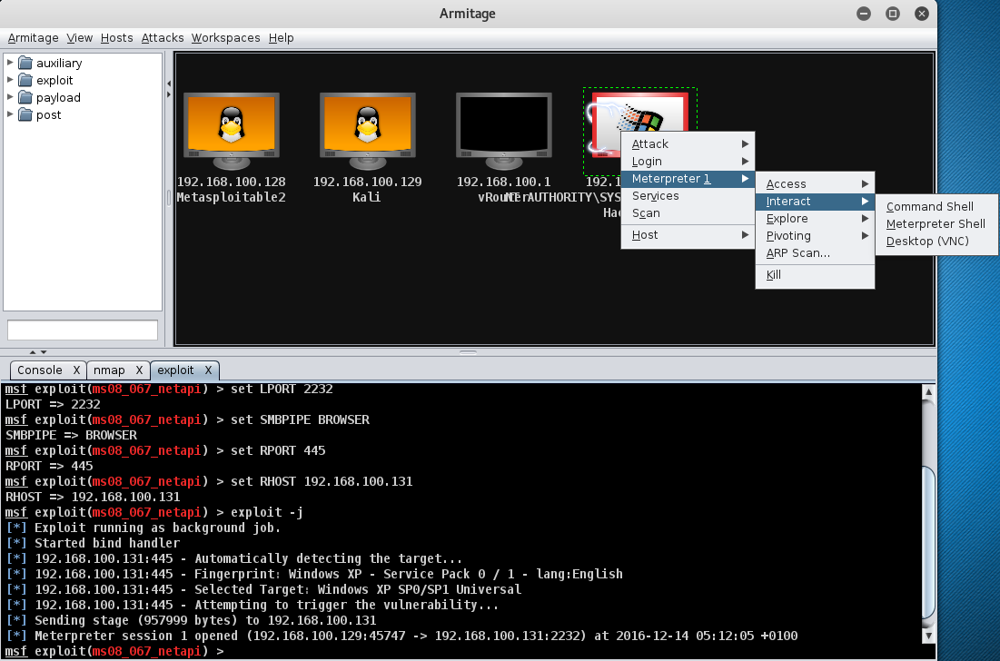

??? reminder "2. A session is now opened with the target"
    

---

!!! important "Findings"

    **Successful Exploitations**:

    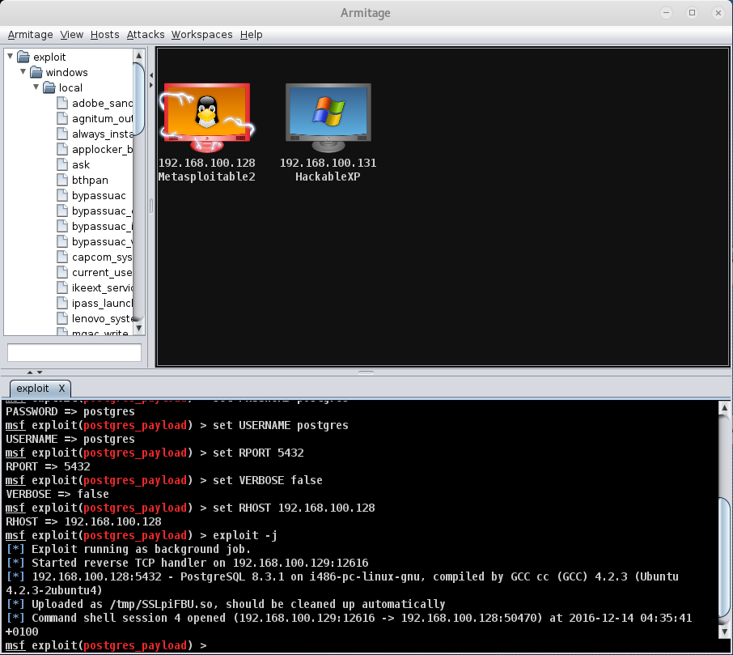

    

